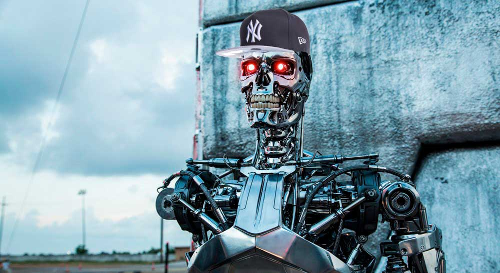

# Dembow
## The first A.I that generates reggaeton hits. 



## Machine Learning Techniques
Using TensorFlow to generate short sequences of music with a [Restricted Boltzmann Machine](http://deeplearning4j.org/restrictedboltzmannmachine.html).
Do you want to go deep?, see the original technical idea: [How to build an RBM neural network in tensorflow](http://danshiebler.com/2016-08-10-musical-tensorflow-part-one-the-rbm/).


## Getting Started

1. Install [Tensorflow](https://www.tensorflow.org/). If you have trouble running Tensorflow installation it may help:

```sh
sudo easy_install pip
sudo pip install --upgrade virtualenv
 export PIP_REQUIRE_VIRTUALENV=false

```

2. Install [Anaconda and dependencies](https://www.continuum.io/downloads)

3.  Create virtualenv
```sh
virtualenv venv

```

4. Activate venv
```sh
source venv/bin/activate
```

5. Install python_midi module in normal procedure
```sh
git clone git@github.com:vishnubob/python-midi.git 
cd python-midi 
python setup.py install
```

6. Install remaining dependencies with pip.
- matplotlib
- numpy
- pandas
- msgpack
- glob
- tqdm

```sh
pip install [dependencies]
```

7. Make magic happen. First train your model with custom parameters and then wait the output. 
```sh
python fire.py
```
Depends of the technical capabilities of your computer, it can take from 5 to 10 minutes.

## Contribute
We need your help feeding and training our current model. If you have reggeaton samples feel free to contribute. 

