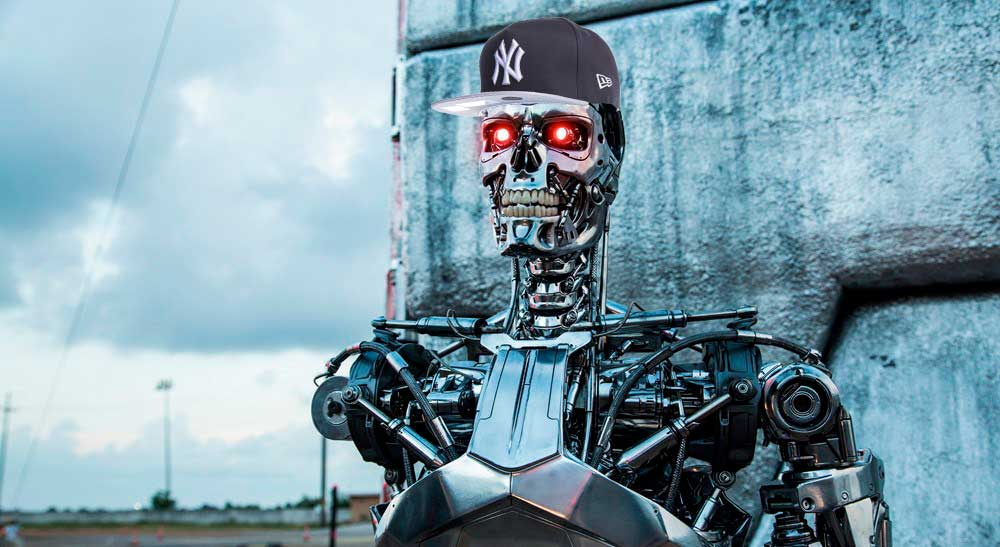

# Dembow
## The first A.I. that generates reggaeton hits. 🔥



Dembow learns the *dembow* groove from a corpus of reggaeton MIDI files and
dreams up new patterns of its own. It is the same scrappy idea it always was —
a **Restricted Boltzmann Machine** sampling reggaeton out of noise — just
brought back to life on a modern stack.

## What changed in the revival

The original 2016 project was wonderful and completely unrunnable today. This
revival keeps its **essence** — the RBM, the piano-roll representation, the
contrastive-divergence training, the Gibbs sampling — while replacing the dead
parts underneath:

| Then (2016)                       | Now                                  |
| --------------------------------- | ------------------------------------ |
| Python 2 (`print "..."`)          | Python 3                             |
| TensorFlow 1.x graph + `Session`  | PyTorch (CPU/GPU)                    |
| `python-midi` (unmaintained, Py2) | [`mido`](https://mido.readthedocs.io) |
| Threw the trained weights away    | Saves & loads checkpoints           |
| One-shot script                   | A real CLI + installable package     |
| `glob('*.mid*')` skipped `.MID`   | Case-insensitive corpus loading      |

The model itself — a Restricted Boltzmann Machine trained with CD-k and sampled
with a Gibbs chain — is unchanged in spirit. See the original write-ups it was
based on: Daniel Johnson's
[biaxial-rnn-music-composition](https://github.com/hexahedria/biaxial-rnn-music-composition)
and Dan Shiebler's
[RBM-in-TensorFlow tutorial](http://danshiebler.com/2016-08-10-musical-tensorflow-part-one-the-rbm/).

## Getting started

```sh
python -m venv venv
source venv/bin/activate
pip install -r requirements.txt      # numpy, mido, torch
# or install the package + `dembow` command:
pip install -e .
```

## Make magic happen

Train the RBM on the included reggaeton corpus, then generate:

```sh
dembow train                 # -> dembow.pt
dembow generate              # -> generated/dembow_*.mid
```

Without installing, the same thing works through the module:

```sh
python -m dembow.cli train
python -m dembow.cli generate
```

Or just light the fire (train + generate in one go, like the original):

```sh
python fire.py
```

### Useful knobs

```sh
dembow train --num-epochs 200 --n-hidden 50 --num-timesteps 15 --lr 0.005
dembow generate --num-samples 10 --tempo-bpm 95 --seed-dir reggaeton_samples
```

By default generation **seeds each Gibbs chain from a real reggaeton song**, so
the output stays in the pocket instead of wandering. Pass `--seed-dir none` to
start from silence like the original did.

## Project layout

```
dembow/
  midi_io.py    MIDI <-> piano-roll, via mido (replaces midi_manipulation.py)
  rbm.py        the Restricted Boltzmann Machine, in PyTorch
  dataset.py    load the corpus, build training windows
  train.py      training loop + checkpointing
  generate.py   sample new patterns and write MIDI
  cli.py        the `dembow` command
fire.py         nostalgic one-shot entry point
reggaeton_samples/   the MIDI corpus
tests/          a fast end-to-end smoke test
```

## Contribute

We still need your help feeding and training the model. If you have reggaeton
MIDI, drop it in `reggaeton_samples/` and open a pull request.
